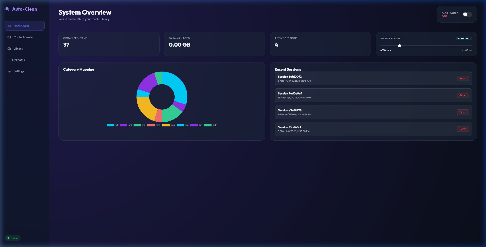

# 🤖 Auto-Media-Organizer

**Transform your chaotic file system into a professional-grade media library.**

Auto-Media-Organizer is an autonomous command center for your digital life. It doesn't just move files; it **inspects**, **hashes**, **labels**, and **curates** your media using deep metadata awareness and high-speed multi-threading.



## 🌟 Key Features

*   🚀 **Turbo Mode**: Real-time Engine Throttle (Eco to Nitro modes).
*   🖼️ **Visual Gallery**: Lazy-loaded thumbnails for all organized media.
*   👯 **Intelligent Deduplication**: Content-aware collision detection and resolution.
*   🌍 **Global Mode**: Manage files anywhere on your PC (Downloads, Desktop, etc.).
*   ⏳ **Undo System**: One-click Revert for any organization session.

---

## 🛠️ Installation

### Option 1: Using `uv` (Recommended)
Fast, reliable, and manages dependencies automatically.
```bash
git clone https://github.com/your-username/auto-media-organizer.git
cd auto-media-organizer
uv run python -m src.api
```

### Option 2: Using `pip`
Classic installation into your own environment.
```bash
pip install -r requirements.txt
python -m src.api
```

---

## 💻 CLI Reference

Access the power of the organizer directly from your terminal.

### `analyze`
Scans a directory and reports proposed changes and duplicate collisions.
```bash
python -m src.cli.main analyze <path> [options]
```
**Options:**
- `--target, -t`: Target directory (defaults to source).
- `--config, -c`: Path to config file (default: `config.yaml`).
- `--workers, -w`: Number of concurrent workers.
- `--mp`: Use multiprocessing for heavy hashing.

### `organize`
Performs the actual file organization and indexing.
```bash
python -m src.cli.main organize <path> [options]
```
**Options:**
- `--target, -t`: Target directory for organized output.
- `--config, -c`: Path to config file.
- `--yes, -y`: Skip the confirmation prompt.
- `--workers, -w`: Number of concurrent workers (Turbo Mode).
- `--mp`: Use multiprocessing.

### `undo`
Reverses the last organization session, moving files back to their origin.
```bash
python -m src.cli.main undo [options]
```
**Options:**
- `--yes, -y`: Skip confirmation and immediately restore files.

### `prune`
Recursively deletes all empty folders in the specified path.
```bash
python -m src.cli.main prune <path> [options]
```
**Options:**
- `--yes, -y`: Proceed with deletion without confirmation.

---

## ⚙️ Configuration
The system is fully customizable via `config.yaml`. Define your own categories, subcategories (keyword-based), and naming conventions (e.g., `{year}/{month}/{filename}`).

## 📄 License
Distributed under the **MIT License**. See `LICENSE` for more information.
